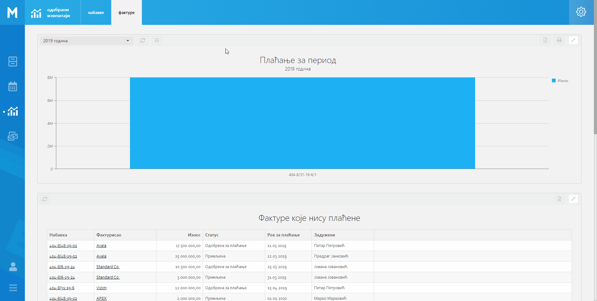
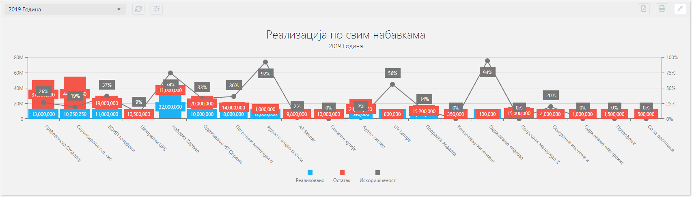
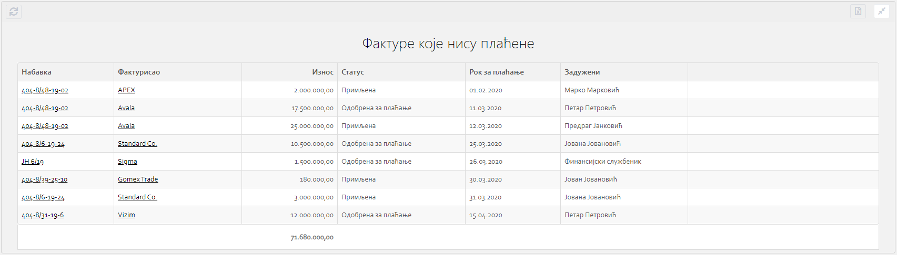
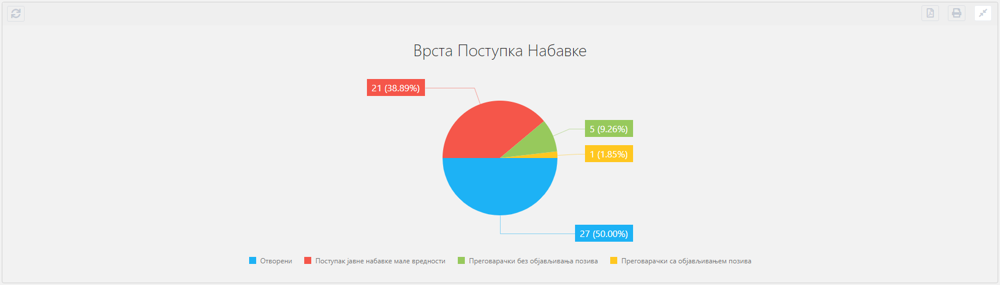
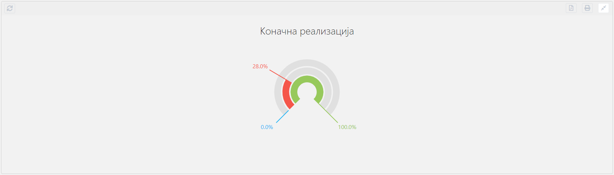
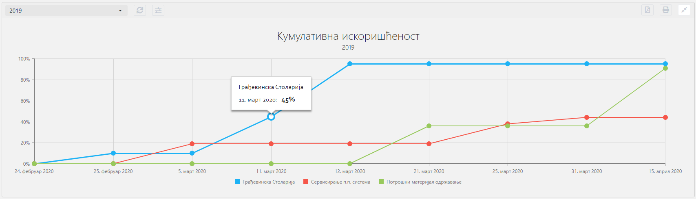

.. _izvestaji:

*********
Извештаји
*********

.. image:: ../_static/img/Izvestaji/Izvestaj2.gif
   :width: 700
   :align: center

Извештаји су модул МеОн апликације који садржи различите типове извештаја, у зависности од нашег пакета и одабраног ентитета. 

Модул Извештаји садржи две целине, једна целина се односи на приказ Dashboard-а. А друга целина се односи на приказ извештаја по ентитету.

Dashboard извештаји садрже оне извештаје које смо одабрали за приказ, односно они извештаји који су нама најбитнији. Приликом отварања модула Извештаји прво што видимо су dashboard извештаји. Уколико немамо извештаја које смо одабрали за dashboard, приказаће нам се текст "Нема изабраних извештаја на Dashboard-u". 

Постоје два начина за одабир извештаја за dashboard:

1. Кроз мени са опцијама, са Dashboard-а. Кликом на мени са опцијама видећемо опцију подешавања, кликом на њу отвориће нам се искачући прозор са две листе. У првој листи видимо све извештаје који су нам доступни, док у другој листи видимо све извештаје који су одабрани за приказ на dashboard-у. Једноставним превлачењем извештаја из леве у десну листу додајемо извештај на dashboard stranu. Исто тако обрнутим превлачењем из десне листе у леву бришемо извештај са dashboard стране.

2. Кроз мени са опцијама, са приказа извештаја по ентитету. Кликом на мени са опцијама видећемо опцију подешавања, кликом на њу отвориће нам се искачући прозор са једном листом свих извештаја за тај одабрани ентитет. На овом прозору кликом на check box можемо додати жељени извештај на dashboard страну. Или ако желимо да уклонимо одређени извештај са dashboard стране, једноставно ћемо одкликнути dashboard опцију из листе и извештај ће бити уклоњен са dashboard-а.

.. Note:: Поред одабира извештаја за dashboard на овим наведеним искачућим прозорима можемо мењати редослед извештаја превлачењем ставки у листама, превлачењем горе - доле мењамо жељену позицију извештаја.

У горњем левом углу ће нам бити приказани ентитети за које можемо видети извештаје (Набавке, Фактуре). Кликом на жељени ентитет добићемо приказ свих извештаја за одабрани ентитет.

**Параметри извештаја**

Извештаји могу садржати параметре који дефинишу податке које можемо видети на извештају. Сваки корисник може да дода, промени или избрише параметар за одређени извештај.

Сваки извештај може бити другачији. Није нужно да сваки извештај садржи одређене параметре. Код извештаја који садрже параметре, променом параметара добићемо друге податке на самом извештају. Сваки параметар дефинисан је именом и вредношћу параметра. Једним именом можемо дефинисати распон датума, одабир месеца или одабир године.

Код извештаја који садрже параметре у горњем левом углу налази се падајући мени са претходно изабраним називом параметра. Овај мени садржи све називе параметара који су у вези са одабраним извештајем. Одабиром другог параметра, кликом на назив тог параметра, добићемо податке на извештају који су дефинисани изабраним параметром.

Поред падајућег менија налази се дугме за освежавање извештаја и дугме за подешавање параметара. Кликом на дугме за освежавање извештаја добићемо последњу информацију која се налази на извештају.

Поред њега налази се дугме за подешавање параметара. Кликом на ово дугме отвориће нам се нови падајући мени у ком можемо променити параметар нашег извештаја, односно његову вредност.

Врсте параметара у зависности од извештаја, које можемо променити, могу бити број године и одабир распона датума. Број године можете дефинисати уносом броја године (нпр. 2019). Распон датума можемо дефинисати уносом почетног и завршног датума параметра. Уносом године или распона датума у зависности од одабраног извештаја, кликом на дугме Сачувај и примени отвара се прозор за унос Назива параметра. Назив параметра можемо дефинисати уносом жељеног назива (нпр. Први Квартал). 

Испод поља за унос назива параметра налази се “check in” опција чијом потврдом жељени параметар постављамо као подразумевани. Овом потврдом жељени параметар постаје увек одабран на том извештају док се одабир не промени. 

У горњем десном углу сваког извештаја налази се: 

**Дугме за штампу извештаја** - кликом на ово дугме можемо одштампати жељени извештај. 

.. image:: ../_static/img/Izvestaji/Izvestaj4.gif
   :width: 700
   :align: center

**Дугме за извоз података** - кликом на ово дугме можемо генерисати жељени извештај као ПДФ документ и сачувати га на нашем рачунару.

.. image:: ../_static/img/Izvestaji/Izvestaj5.gif
   :width: 700
   :align: center

**Дугме за смањивање извештаја** - кликом на ово дугме умањујемо одабрани извештај, како не би заузимао простор на прозору за извештаје, и добијамо прегледнији приказ прозора са извештајима. Поновним кликом на исто дугме вратићемо извештај на претходну величину.

.. image:: ../_static/img/Izvestaji/Izvestaj6.gif
   :width: 700
   :align: center

Типови 
=========

Типови извештаја Ме Он апликације:

 * Ступчани графикон (Bar chart)
 * Табела
 * Пита графикон (Pie chart)
 * Кључни показатељ (KPI)
 * Линијски графикон (Line Chart)

Ступчани графикон (Bar chart)
------------------------------

Ови типови извештаја погодни су када се користе на основу једне или више серија података. У сваком ступацу у извештају може бити приказано више вредности, односно више серија података. Уколико постоји више серија података, ступац ће бити подељен тако да приказује однос вредности добијених података. 

У примеру који следи можемо видети ступчани извештај реализације свих набавки компаније за одређену годину. Свака набавка у овом извештају је представљена бојама које означавају следеће податке: плава боја представља реализовани износ, црвена боја остатак износа који треба да се реализује и сива вредност представља искоришћеност конкретне набавке у процентима.

Табела
-------------------

Табеларни извештаји представљају извештаје чији подаци су приказани у табели. 

Најчешћа примена оваквих извештаја може се видети на ентитету Фактуре. 

Пример: На оваквом извештају можемо видети све Фактуре које нису плаћене. У самом извештају можемо видети најбитније детаље Факутре - Статус, Износ, Рок за плаћање, Задужено лице, Број набавке и Назив уговорне стране.

.. note:: Табеларни приказ података разликује се од стандардних извештаја, по проширеном сету опција који нуди. Овакав тип извештаја називамо и интерактивним извештајем. Интерактиван зато што садржи опцију да кликом на неки од атрибута можемо видети регистар ентитета. У конкретном примеру, кликом на Број набавке приказаће нам се детаљи набавке, а кликом на Назив уговорне стране приказаће нам се детаљи фактуре.

Пита графикон (Pie chart)
--------------------------

Пита графикон је тип извештаја који је најпогоднији за графички приказ једноставних извештаја на којима се приказује удео сваке од вредности.

У зависности од података самог извештаја вредности могу бити приказане бројчано и процентуално. 

Пример: На овом извештају можемо видети врсте поступака набавки, број набавки одређене врсте и процентуални однос сваке врсте у односу на све набавке.  

Кључни показатељ (KPI)
-----------------------

Овај тип извештаја - КПИ (Key Performance Indicators) представља извештај у којем се ефикасно визуализују кључни показатељи перформанси. Компаније користе ове извештаје како би пратиле напредак пословања у односу на задате циљеве.

Пример: На оваквом типу извештаја можемо видети успешност реализације буџета наше компаније кроз коначну реализацију набавки.

Линијски графикон (Line chart)
-------------------------------

Линијски графикони приказују континуиране податке током времена и представљају извештаје у којима можемо видети како се одређени пословни показатељи мењају кроз временски период. 

Информације су постављене у једнако подешене осе и зато је овај тип извештаја идеалан за приказивање трендова у подацима у једнаким интервалима.

Пример: На овом извештају можемо видети Кумулативну искоришћеност набавки за 2019 годину. На примеру су приказане три набавке у временском периоду, на X оси можемо видети датуме а на Y оси можемо видети износе. Превлачењем миша преко тачака које су обележене у пресеку X i Y ose видимо податак о проценту искоришћености набавке у одабраном тренутку времена. 
