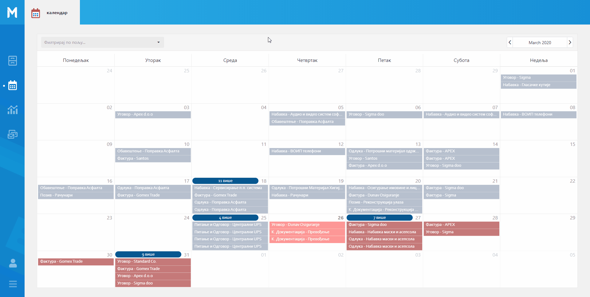

.. _kalendar:

********
Календар
********

Свака инстанца ентитета садржи атрибуте који су дефинисани датумским пољима. На основу датумских атрибута можемо видети инстанце ентитета приказане у календару.

Календар представља приказ свих инстанци ентитета и свих њихових поља.

Једна инстанца ентитета може се налазити у више датумских поља, у зависности од датумских атрибута инстанце ентитета.

У самом врху стране испод наслова "Календар", налази се падајући мени који представља филтер који служи за филтрирање календара по пољу. У падајућем менију се налазе сва поља ентитета која можемо видети на календару, у листи нам је излистан прво ентитет а поред њега и поље по ком можемо филтрирати податке. За исти ентитет могу постојати више поља по којима се могу филтрирати подаци. 

Приликом отварања календара приказана су нам сва поља ентитета која тренутно постоје за одабрани месец. Филтрирањем поља добијамо приказ календара по одабраном пољу ентитета, тако да ћемо видети све инстанце ентитета које садрже одабрано поље. Одабиром поља из филтера отвориће нам се нови прозор календара са филтрираним подацима и видећемо све инстанце ентитета које садрже одабрано поље. 

У сваком тренутку можемо кликнути на "Календар" односно почетни екран календара који садржи сва поља ентитета и на ком можемо одабрати ново филтрирање по пољу.

.. Tip:: Падајући мени за филтрирање података се налази на почетном екрану календара који садржи све ентитета и сва њихова поља.

Примери из праксе који могу илустровати једноставност оваког начина приказа информација:

Пример 1.

Начелник и ит службеник могу видети различите информације на истом ентитету. Начелник na ентитету конкурсна документација може видети статус набавке која је везана за изабрани ентитет: конкурсна документација, задужено лице, тип конкурсне документације, статус самог документа конкурсна документација... За исти одабрани енититет конкурсне документације Ит службеник види: задужено лице, датум објаве документације као и број документације. На овај начин приказују се само одабране информације, у зависности од пакета који користимо. Циљ оваквог приказа информација јесте да се на што лакши и бржи начин дође до информације која нам је потребна. 

Пример 2.

Кликом на инстанцу фактуре у одабраном датумском пољу календара и увидом у детаље корисник је уочио да, истиче рок за плаћање фактуре и да је статус фактуре "неплаћена".
Жели да провери зашто фактура није плаћена. Да би добио жељену информацију о плаћању потребно је да, контактира особу која је задужена за плаћање фактуре. То можемо урадити кликом на икону за слање поруке поред имена задуженог лица у детаљима, након чега ће се отворити прозор за чет у којем ће корисник послати поруку одабраном лицу. 

Детаљније о чету и порукама у поглављу :ref:`Пошта<posta>`.

Кликом на било коју инстанцу, која се налази у датумском пољу календара, можемо видети додатне детаље исте (искачући прозор).

Искачући прозор садржи најбитније информације о самој инстанци ентитета у зависности од пакета који имамо. У врху искачућег прозора на календару видимо назив самог ентитета и назив инстанце ентитета. Назив инстанце је подвучен и кликом на њега отвориће нам се регистар изабране инстанце ентитета. Испод назива, налазе се најбитнији атрибути одабраног ентитета. Први атрибут представља датум који смо одабрали на календару. 

У зависности од пакета који користимо можемо видети разлчите информације у детаљима календара. Сваки корисник може видети регистар изабраног ентитета, кликом на назив ентитета, и може послати поруку задуженом лицу кликом на икону поште, након чега нам се отвара нови прозор за чет.

У горњем левом углу кликом на "бирач датума", можемо променити месец и годину и тиме добити одабрани приказ ставки у календару. 

.. Tip:: У детаљима инстанце ентитета, поред имена особе налази се икона за слање поруке, кликом на икону отвориће нам се чет где можемо послати поруку одабраној особи. 

Постоји 6 различитих индикатора у бојама које можемо видети на календару.

.. |logo3| image:: ../_static/img/Kalendar/kalendar14.png
   :width: 25
   :height: 25

|logo1| - Датум у прошлости за било који ентитет осим за онај који је одабран у главном менију.

|logo2| - Датум у прошлости за одабрани ентитет у главном менију.

|logo3| - Данашњи датум за било који ентитет осим за онај који је одабран у главном менију.

|logo4| - Данашњи датум за одабрани ентитет у главном менију.

|logo5| - Датум у будућности за било који ентитет осим за онај који је одабран у главном менију.

|logo6| - Датум у будућности за одабрани ентитет у главном менију.

.. Tip:: Кликом на наслов (подвучени текст у искачућем прозору) ентитета у детаљу календара, отвара нам се регистар изабраног ентитета.
