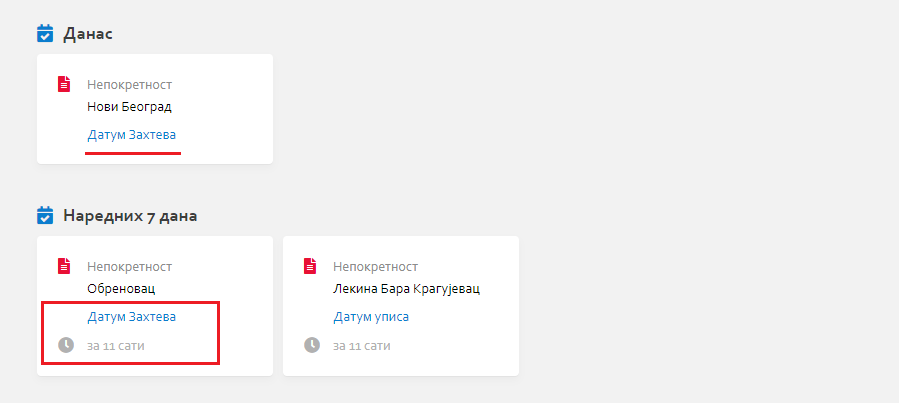

.. _kontrolna tabla:

***************
Контролна табла
***************

Контролна табла представља сажетак свих најбитнијих информација које се налазе на једном месту.

Страна је подељена у више целина:

Данас, Наредних 7 дана
======================

Горњи леви део екрана је "резервисан" за информације и догађаје који се дешавају данас и у наредних 7 дана.

У оквиру ових целина, налазе нам се прозори на којима је дефинисано поље које означава неки рок. Кликом на жељени прозор , отвориће нам се детаљи тог документа.

Инспекција
==========

У оквиру ове целине налазе се валидације/обавештења везана за Непокретности, Порезе и слично. Оне помажу корисницима да увиде шта није у реду са одређеним документима. Кликом на жељено обавештење, отвориће нам се детаљи тог документа.

Превлачењем миша преко обавештења појавиће се панел са основним информацијама тог документа.

Активности
==========

Активности представљају целину на којој можемо видети последње промене које су се десиле на документима, ко их је направио као и време промене. 

Кликом на икону у горњем десном углу целине отвара нам се преглед модула поште где се налази списак свих активности.

Долазна пошта
=============

У оквиру ове целине видимо све долазне поруке, документ за коју је порука послата, ко је поруку послао и време поруке. 

Кликом на поруку отвара нам се чет прозор са преписком везаном за тај документ. Кликом на назив документа, отвориће нам се страна са детаљима документа. Кликом на икону у горњем десном углу целине отвара нам се преглед модула поште где се налази сва долазна пошта.

