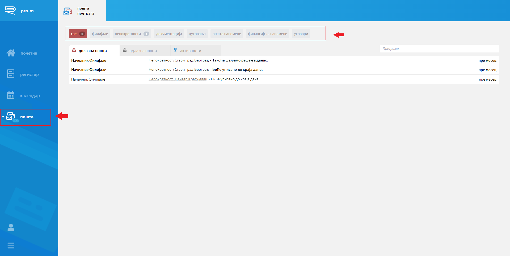
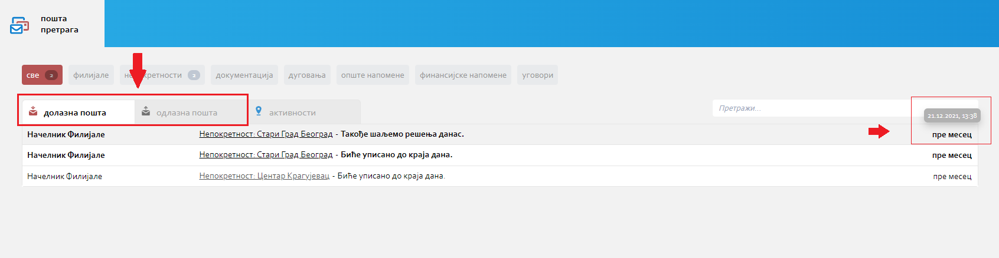
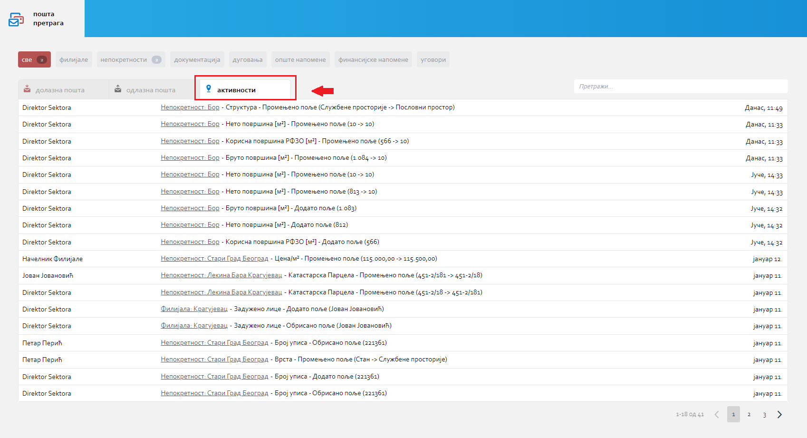
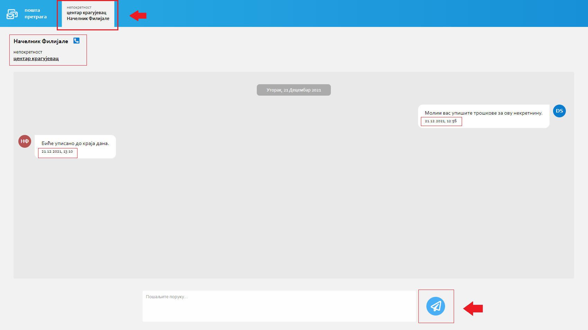

.. _posta:

********
Пошта
********

Пошта представља модул Про-М апликације који омогућава колаборацију између корисника. Овде се налази преглед свих долазних/одлазних порука и активности везаних за Филијале, Непокретности и остале ентитете.

На самом врху стране налази се списак свих ентитета по којима је могуће филтрирати податке. Такође, ове картице садрже и беџ уколико постоје непрочитане поруке на неким од ентитета. 
Пошту је могуће додатно филтрирати уз помоћ табова који се налазе испод наведених картица: Долазна пошта, Одлазна пошта и Активности.

Долазна / Одлазна пошта
=============================
Табела где се налази списак свих примљених/послатих порука сортирани по датуму слања. У првој колони налази се име особе која је послала поруку, у другој се налази информација на нивоу ког документа се врши преписка (са могућношћу навигације на конкретан документ) и порука, док се у трећој налази време слања поруке (преласком миша преко ове колоне добијамо тачан датум и време).

Активности
==========
Информације које се односе на документ, када је неко поље додато, промењено или обрисано, информације о особи која је измену направила и време.

Чет
===
Кликом на примљене или послате поруке у пошти отварамо прозор за Чет где можемо комуницирати са особом везано за конкретан документ. Свака преписка са другим корисником, биће отворена као нова картица на врху стране.

У прозору за чет, у горњем левом углу, налази се име и презиме кореспондента, телефон и назив документа на коју се преписка односи (могућност навигације на детаље документа).

Поруке у чету приказане су хијерархијски од најновије до најстарије, у смеру навише.

Свака порука садржи датум и време слања у доњем углу саме поруке.

Поље за унос поруке и дугме Пошаљи налази се на дну екрана.

.. Tip:: Поруку можете послати и комбинацијом тастера Shift + Enter

