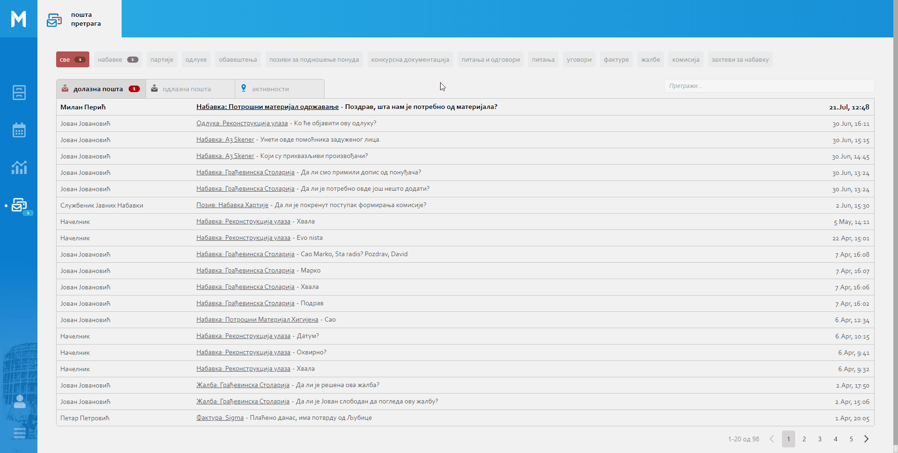
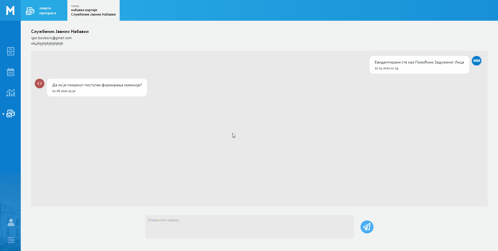

.. _posta:

********
Пошта
********

Пошта представља део MeOn апликације који садржи информације у виду порукa и нотификацијa за одабрани ентитет. Све информације у овом модулу приказане су у листи, по хронолошком реду подељене у три целине. У самом врху стране имамо могућност филтрирања поште по ентитетима. Прегледом поште предефинисана селекција ентитета је на "Све", што значи да ће нам бити приказана сва пошта без обзира на ентитет. У случају да желимо да видимо пошту само за одређени ентитет у горњем делу екрана одабиром жељеног ентитета филтрирамо пошту тако да видимо само ону пошту која се односи на одабрани ентитет.

Информације које се налазе у овој листи приказане су као:

Долазна пошта
 Примљене поруке. Поред примљених порука од стране других лица можемо добити и поруку која нас обавештава да смо евидентирани на типу поља Корисник неке инстанце ентитета. Ако је неко задужио нас као задужено лице, добићемо поруку "Евидентирани сте као Задужено Лицe". Исто важи и за остала поља типа Корисник ( Помоћник Задуженог Лица, Контролор, Потписник...).

Одлазна пошта
 Послате поруке.

Активности
 Нотификације које се односе на документ, приказују иформације о самом документу. Када је неки документ додат или обрисан, као и информација о особи која је тај документ изменила.
 Нотификације које се односе на поље документа, приказују информације о самом пољу документа. Када је неко поље документа додато, промењено или обрисано, као и информација о особи која је поље документа изменила.

Све нове поруке и нотификације налазе се на врху ових листа. Остале прочитане поруке, послате поруке и прегледане нотификације налазе се у наставку листа. У листи свака примљена порука, послата порука и нотификација садржи конкретну инстанцу ентитета и садржину истих.

Нотификације које ће нам бити приказане разликују се у зависности од нашег пакета као и ентитета који је одабран.

Индикатор нових порука и нотификација приказан је беџом, у менију са леве стране, на икони поште. Кликом на икону поште са беџом добићемо увид у листу свих порука и нотификација. Ако постоје нове поруке и активности (нотификације), биће нам приказане поред сваког од ентитета у врху стране, предефинисана селекција ентитета је на "Све" и овде беџ садржи збир свих нових порука и активности.

Отварањем листа (долазна пошта, одлазна пошта, активности) нове нотификације биће означене као "прегледане", и тиме ће се индикатор умањити за број прегледаних нотификација. Поруке остају "непрегледане" и индикатор непромењен, све док не отворимо нове примљене поруке.  

Кликом на примљене и послате поруке у пошти отварамо прозор за Чет у којем можемо остварити, односно наставити комуникацију везану за одабрану инстанцу ентитета. Свака преписка са другим корисником, биће отворена као нови прозор у врху стране.

Кликом на назив документа у примљеним, послатим порукама и нотификацијама отвориће нам се новои прозора поште у којем је приказна сва пошта везана за одабрану инстанцу ентитета (примљене, послате поруке и нотификације).

Чет
---

Чет је још један начин комуникације у оквиру МеОн апликације.
У чет-у се може остварити комуникација између два корисника.

Постоји више начина начина за започињање комуникације преко чет-а:

1. Кликом на Мени са опцијама, у горњем десном углу детаља инстанце ентитета, и одабиром Нова Порука отвара нам се прозор за Одабир кореспондента. Кликом на име кореспондента, отварамо нови прозор за чет и тиме започињемо комуникацију са одабраном особом. 

2. Кликом на икону поште поред испод имена корисника у детаљима инстанце ентитета отварамо нови прозор за чет и можемо започети комуникацију са одабраном особом.

3. Из календара у детаљима инстанце одабраног ентитета и кликом на икону поште поре имена корисника отварамо нови прозор за чет и можемо започети комуникацију са одабраном особом.

4. Кликом на примљену или послату поруку у пошти, отвара нам се прозор за чет.

О истој инстанци ентитета могу комуницирати различити корисници.
Коришћењем чет-а на најлакши начин можемо остварити комуникацију везану за инстанцу одабраног ентитета. Свака послата порука у чет-у односи се на конкретану инстанцу ентитета. Конкретна инстанца ентитета увек се види и приказана је на врху стране у одабраном прозору. 

Пример:

Службеник за јавне набавке уочио је да у набавци "Осигурање имовине и лица" недостаје Рок за подношење понуда и податак о Општем Речнику Набавке (ОРН). Увидом у детаље инстанце овог ентитета, кликом на икону поште испод имена задуженог лица, службеник отвара прозор за чет и поставља питање задуженом лицу о року за подношење понуда. Службеник се враћа на детаље инстанце једноставним кликом на инстанцу ентитета у горњем делу екрана. Кликом на икону поште испод имена помоћника задуженог лица, у детаљима инстанце истог ентитета, отвара нови прозор за чет и поставља питање о податку ОРН-а.

Овакав пример представља једноставан начин комуникације, који се односи на конкретну инстанцу ентитета. Кроз два независна чета корисник је остварио комуникацију са две различите особе о истој инстанци ентитета. Корисник је директно задуженом лицу и његовом помоћнику поставио питање, без потребе да конкретизује инстанцу ентитета. На основу инстанце ентитета приказане у примљеној поруци поште и у прозору за чет, лице којем је порука упућена зна о којој инстанци ентитета се ради.

Чет запосленима олакшава комуникацију без додатног коришћења осталих средстава комуникације.

У прозору за чет, у горњем левом углу, налази се име и презиме кореспондента, број телефона и мail адреса. Кликом на мail адресу кореспондента, можемо послати мail путем екстерне мail апликације коју тренутно користимо на нашем рачунару.

На среднини прозора за чет, налази се поље за преглед примљених и послатих порука.

Поруке у чету приказане су хијерархијски од најновије до најстарије, у смеру навише.

Свака порука садржи датум и време када је порука примљена односно послата.

.. Tip:: Кроз поље за преглед порука можете се кретати коришћењем scroll bar-а у десној страни екрана.

Поље за унос поруке и дугме Пошаљи налази се на дну екрана.

.. Tip:: Поруку можете послати и комбинацијом тастера Shift + Enter