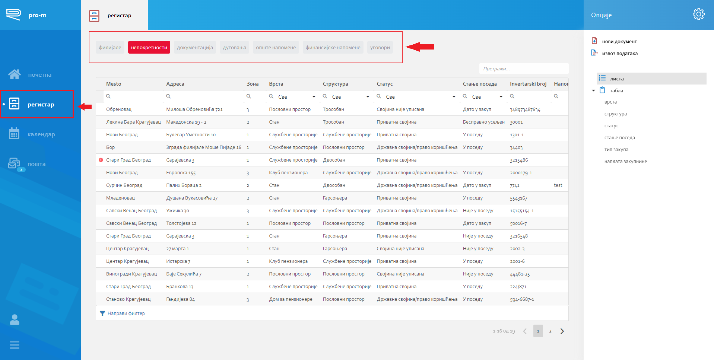

.. _registar:

**********
Регистар
**********

Регистар представља основни модул Pro-M апликације у коме се евидентирају, претражују и приказују сви подаци од интереса за организацију.

.. _lista:

Листа докумената
================
Омогућава приказ записа било ког ентитета (филијале, непокретности...). Филтрирање по ентитету се врши кликом на једну од наведених картица у горњем делу прозора. 

Ова секција састоји се од два начина приказа: Листа и Табла, која се налазе у десном менију са стране.

* **Листа**
 Листа представља основни део регистра. Записи су приказани у табели која има многобројне функционалности као што су сортирање, филтрирање, предефинисани филтери и претрага. Кликом на документ у табели иде се на детаљ истог. 

* **Табла**
 Приказ докумената који су груписани на основу неког статуса. У панелима се налазе најбитније информације о документу. Такође, могућа је и навигација на детаљ документа. Овај начин приказа омогућава ажурирање вредности статуса превлачењем панела у жељену колону.

 .. image:: ../_static/img/Registar/kanban.png
   :width: 700
   :align: center

.. _filteri:

Филтери
-------

Филтрирање података у табели се врши по колони. Испод заглавља табеле у свакој колони налази се ћелија у коју је могуће уписати вредност по којој ће се подаци филтрирати за ту колону. Поред текстуалног уписа могуће је изабрати и операцију приликом филтрирања (да ли вредност треба да садржи задати текст или треба да буде мања/већа од задате...).

 .. image:: ../_static/img/Registar/filter-column.png
   :width: 700
   :align: center

Други поступак филтрирања јесте креирање сопственог филтера преко искачућег прозора који се отвара у доњем делу табеле - Направи филтер. Овде је могуће додати више услова по колони као и одабир операција.

 .. image:: ../_static/img/Registar/filter-popup.png
   :width: 700
   :align: center

Сваки филтер који се примени над табелом може да се сачува као предефинисани филтер. Ово значи да корисник може себи да направи листу филтера које често користи у раду. Предефинисани филтери налазе се у падајућој листи у горњем левом углу изнад табеле.

 .. image:: ../_static/img/Registar/predefined-filter.png
   :width: 700
   :align: center

**Направи филтер**

Да бисте сачували примењени филтер над табелом потребно је да се кликне на иконицу Сачувај (у облику дискете поред падајуће листе), након тога ће се отворити прозор са захтевом да се унесе име филтера, затим само дугме потврде.

**Избриши филтер**

Да бисте избрисали предефинисан филтер потребно је да се филтер изабере из падајуће листе, затим кликне иконица Обриши (у облику кантице поред падајуће листе).

**Поништи филтер**

Уколико желите да поништите изабрани филтер потребно је кликнути на дугме X поред назива филтера или у доњем десном углу табеле - Очисти.

.. _izvoz:

Извоз (Export) докумената
-------------------------
Када се налазимо на листи докумената у десном менију са стране појавиће се опција за извоз докумената у Еxcel. 

Кликом на ту опцију отвара се прозор где је потребно означити које колоне из табеле ће се извести у Еxcel фајл. 

 .. image:: ../_static/img/Registar/export-grid.png
   :width: 700
   :align: center

.. Note:: Ова опција је доступна и на :ref:`детаљу документа<detalj>` уколико је потребно извести записе од подређених ентитета.

.. _novizapis:

Нови запис
=============
Опција која је, као и опција :ref:`Извоз података<izvoz>` , доступна у десном менију са стране. 

Уколико се додаје нови документ који је потребно да буде везан за документ који му је у хијерархији надређен, отвара се прозор са табелом надређених докумената где се одабиром прелази на страну за унос новог записа.

 .. image:: ../_static/img/Registar/new-document.png
   :width: 700
   :align: center

Ако је запис који желимо да унесемо независтан од других овај део са одабиром надређених се прескаче и кориснику се одмах отвара страна за унос новог документа.

.. Note:: Ова опција је доступна и на :ref:`детаљу документа<detalj>` уколико је потребно додати нови документ за понуђене подређене ентитете.

.. _detalj:

Детаљи документа
=================
У овом модулу налазе се сви подаци о изабраном документу. Страна је подељена на групе поља и подређене ентитете, које садрже везане (подређене) документе и ови панели могу се проширити или скупити. 

 .. image:: ../_static/img/Registar/details.png
   :width: 700
   :align: center

Свако поље састоји се од лабеле, опционе иконице поред лабеле која садржи опис самог поља и вредности поља. У зависности од улоге у организацији омогућен је унос/измена/брисање поља. Брисање вредности поља се врши тако што се кликне иконица (у облику кантице) која постаје видљива након превлачења миша преко поља. Када се вредност бар једног поља промени у доњем делу екрана појављују се два дугмета: Сачувај измене и Откажи измене. Тек након потврде ових акција вредности се ажурирају.

 .. image:: ../_static/img/Registar/crud.png
   :width: 700
   :align: center

Списак докумената подређених ентитета има исту структуру и функционалности као и у листи регистра. Проширивањем овог панела постају нам видљиве две опције за унос новог документа и извоз података.

 .. image:: ../_static/img/Registar/instance-subentity.png
   :width: 700
   :align: center

Доле наведене опције налазе се у менију са десне стране:

.. _poruka:

Нова порука
-----------
Кликом на ову опцију отвара се прозор са листом корисника којим можемо послати поруку везану за овај документ. Одабиром корисника отвара се чет.

.. _info:

Инфо
----
Ова секција приказује када су направљене последње промене за свако поље и ко је те промене направио. Поред ових информација на датумским пољима можемо видети информацију када се одређени датум, рок приближава односно пре колико времена је истекао. 

 .. image:: ../_static/img/Registar/instance-history.png
   :width: 700
   :align: center

На овом прозору је доступна још једна функционалност, а то је историја промена за свако поље. Кликом на иконицу у колони Историја добијамо преглед промена тог поља - ко је промену начинио, која је вредност била и када се промена десила.

 .. image:: ../_static/img/Registar/field-history.png
   :width: 700
   :align: center

.. _detaljposta:

Пошта
-----
Навигација на пошту изабраног документа где ће се приказивати долазна/одлазна пошта и активности само за тај документ. 

.. _inspekcija:

Инспекција
----------
Инспекција садржи разна обавештења и валидације везане за документ на ком се налазимо као и за његове подређене (везане) документе. Ако су све валидације прошле односно нема проблема приликом унетих података, у делу испекција биће приказана зеленa иконица са поруком "Ок".

 .. image:: ../_static/img/Registar/inspection.png
   :align: center

.. Tip:: На подређеним (везаним) документима најбитније информације можемо добити превлачењем миша преко валидације. Кликом на назив документа отвара се страна са детаљима истог.

.. _brisanje:

Брисање документа
=================
На детаљу документа у десном менију са стране налази се опција Избриши документ.

Извршавањем ове акције сва везана (подређена) документа се такође бришу. Кориснику ће овај вид обавештења бити доступан пре потврде саме акције.

 .. image:: ../_static/img/Registar/delete-document.png
   :width: 700
   :align: center

