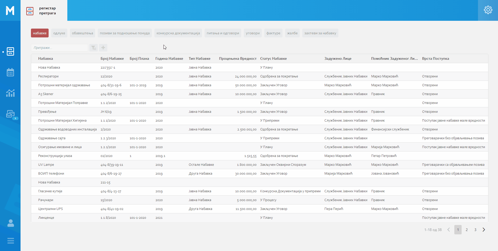
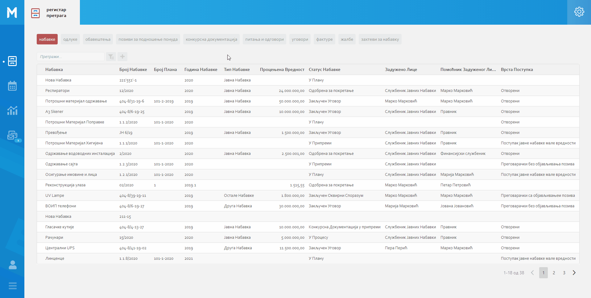
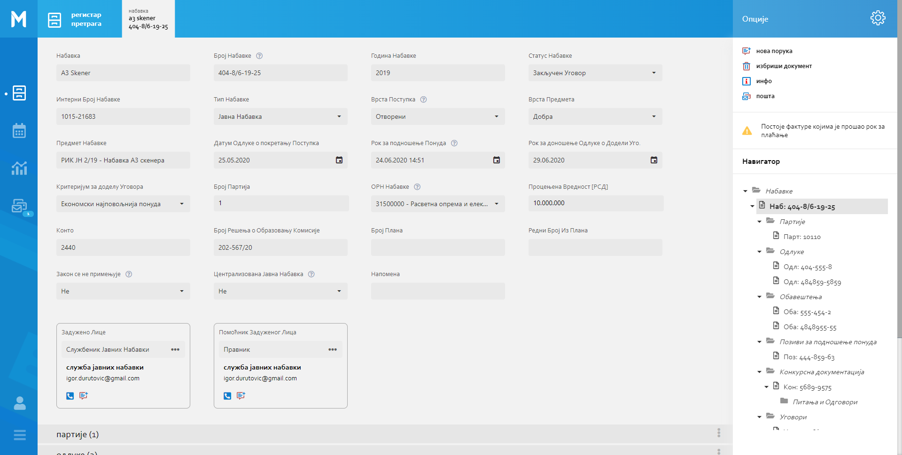
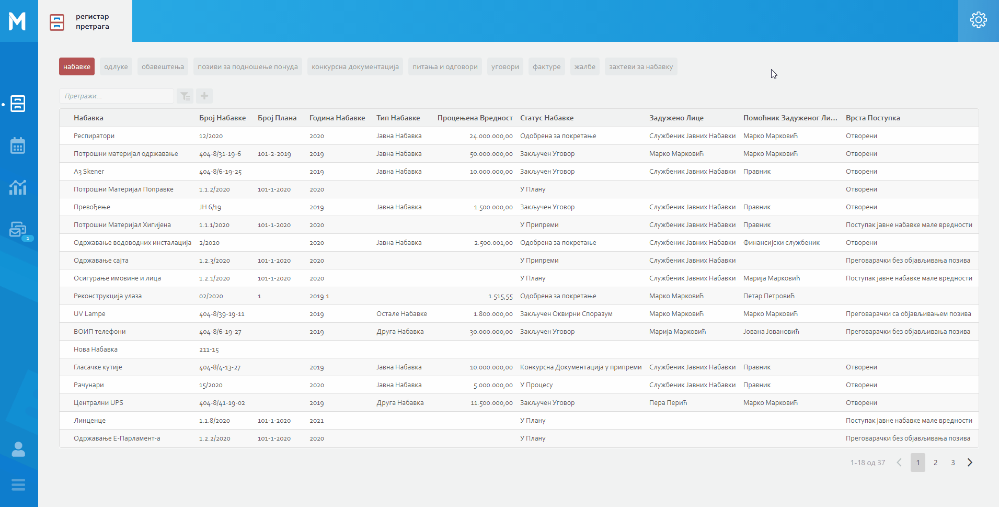
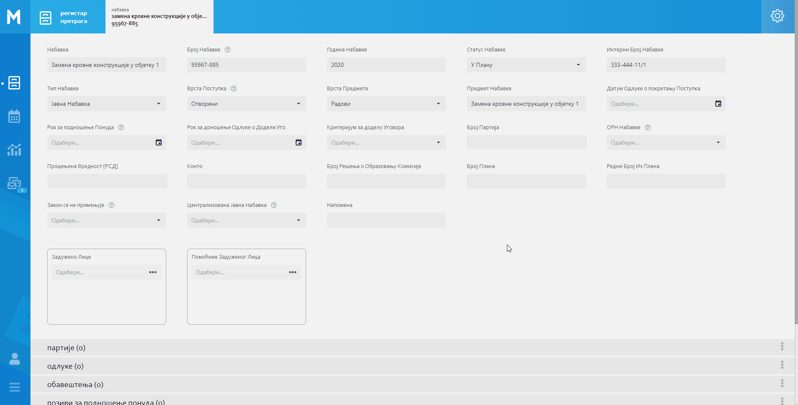
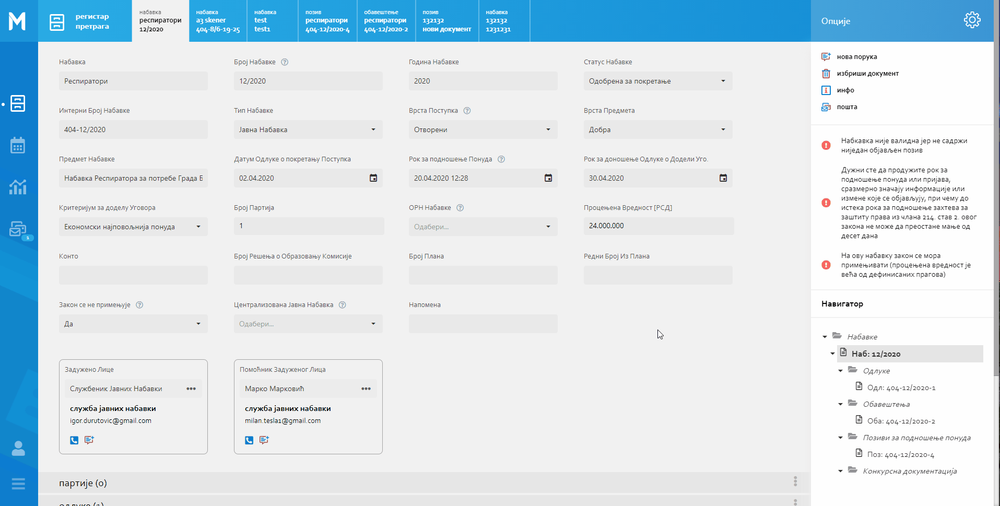

.. _registar:

**********
Регистар
**********

Регистар представља основни модул МеОн апликације у коме се евидентирају, претражују и приказују сви подаци од интереса за организацију (законски и интерни).

МеОн омогућава кориснику лаку претрагу података и брзо долажење до потребних докумената коришћењем :ref:`листа<lista>`, :ref:`детаља<detalj>` и :ref:`фасцикле<fascikla>`.

.. image:: ../_static/img/Evidencija/registar.png
   :width: 700
   :align: center

**Мени са опцијама**

У горњем десном углу екрана, налази се икона која представља мени са опцијама. Опције менија зависе од корисникове позиције у апликацији. 

Неки од могућих опција које ће касније бити објашњене су :

 *  Додавање новог документа
 *  Извоз података из листе
 *  Брисање документа
 *  Нова порука

.. _lista:

Листа
------

Листа представља основни део :ref:`Регистра<registar>`. МеОн омогућава приказ листа било ког ентитета (Набавке, Одлуке, Обавештења, Уговори, Фактуре...) једноставним кликом на жељени ентитет у врху екрана регистра.

Листа представља приказ структуре података у МеОн апликацији. Одликује се линеарним распоредом података, у којем можемо видети инстанце ентитета и њихова поља, односно атрибуте. 

.. Tip:: Кликом на жељену инстанцу енитета из листе, приказаће нам се детаљ одабране инстанце ентитета. 

.. image:: ../_static/img/Evidencija/registar.png
   :width: 700
   :height: 400
   :align: center

Приказ листе укључује и поље за претрагу, које нам може помоћи када желимо да претражимо или филтрирамо податке по нашим потребама. Уносом бар једног карактера, листа ће се аутоматски филтрирати и уколико постоје записи који одговарају претрази приказаће се са означеним карактерима које смо претходно унели у поље за Претрагу.

.. Tip:: На листама било ког ентитета (сем Набавке), у првој колони можемо видети Набавку за коју је конкретна инстанца везана (на листи ентитета Обавештења можемо видети и којој набавци свако обавештење припада). Кликом на набавку у листи отвориће нам се детаљ те Набавке.

.. Note:: Листа се такође налази на детаљу инстанце ентитета испод поља ентитета. Кликом на назив ентитета проширујемо листу и видимо њен садржај.

.. image:: ../_static/img/Navigacija/listaDetalj.png
   :width: 700
   :height: 400
   :align: center

Нови документ
=============

Код уноса нових докумената, разликујемо два приступа

* Унос набавке
* Унос докумената везаних за набавку

Унос новог документа набавке се врши са листе регистра и одабраним ентитетом "Набавка". Кликом на опцију нови документ који се налази у горњем десном углу екрана, у менију са опцијама. 

За разлику од набавке, унос осталих (везаних) документа се врши са конкретне набавке, одабиром опције "Нови Документ" из листе подентитета. У горњем десном углу сваке листе подендитета на детаљима инстанце набавке, налази се мени са опцијама где можемо наћи опцију "Нови Документ". Кликом на ту опцију отвара нам се нови прозор за унос нове инстанце подентитета.

Сваки од подређених ентитета мора имати везу са главним ентитетом Набавка.

Уносом новог документа уствари генеришемо нову инстанцу одабраног ентитета.

Кликом на опцију за додавање новог документа отвара нам се детаљ, са празним пољима изабраног ентитета, која можемо попунити жељеним подацима. Кликом на Сачувај у горњем десном углу, снимамо нову инстанцу у регистар.

Да би нам овај начин додавања новог документа био јасан, објаснићемо га кроз примере.

Пример:

**Желимо да додамо нову набавку.**

Отварањем регистра преселектован нам је ентитет Набавка и добијамо листу свих набавки којима имамо приступ. У менију са опцијама кликом на опцију "Нови Документ" и попуњавањем жељених података додајемо нову инстанцу ентитета Набавка.

**Желимо да додамо нову Одлуку за постојећу Набавку.**

Отварањем регистра преселектован нам је ентитет Набавка. Добијамо листу свих набавки и кликом на жељену набавку приказују нам се детаљи те набавке. Испод поља инстанце ентитета налазе се листе са подређеним ентитетима. Кликом на листу ентитета Одлука, прошириће нам се листа и видећемо све одлуке одабране Набавке. У менију са опцијама кликом на Нови документ и уносом података можемо додати жељену Одлуку за постојећу Набавку.

**Желимо да додамо нову фактуру за постојећу Набавку.**

Сходно хијерархијском моделу који је примењен у апликацији МеОн, знамо да је свака фактура везана за одређени уговор, а уговор везан за набавку. У Регистру кликом на ентиет Уговори у горњем делу екрана, увидом у листу уговора, видимо који уговор припада којој Набавци. Бирамо жељени уговор, приказују нам се детаљи уговора и у дну прозора листа са подређеним ентитетима, у овом случају листа фактура. Кликом на листу ентитета Фактуре, приказаће нам се листа свих фактура за одабрани уговор. У менију са опцијама на одабраној листи видимо опцију за додавање новог документа и кликом на ту опцију отвориће нам се нови прозор са пољима односно детаљем инстанце ентитета Фактура. Уносом жељених података и кликом на Сачувај додали смо фактуру за жељену Набавку.

Извоз Података
===============

На свакој листи одабраног енитета, у менију са опцијама постоји опција за извоз података. Ова опција представља могућност да листу ентитета сачувамо на нашем рачунару као Еxcel документ.

На овај начин можемо снимити податке у фајл. 

Можемо сачувати и филтриране податке, без обзира да ли смо податке филтрирали уз помоћ филтера или претраге. Након коришћења филтера или претраге, кликом на Извоз података добијамо документ који садржи само податке које видимо на екрану.

.. Note:: Дугме за извоз података се такође налази у детаљу инстанце ентиета, на листама подређених ентитета. У углу листе се налази икона (три тачке), кликом на њу приказаће нам се мени где се налази дугме за извоз података.

Филтер
=======

Филтрирањем података у листи можемо брзо пронаћи жељени податак. Податке можемо да филтрирамо по једној или више колона података. Приликом филтрирања можемо да контролишемо шта видимо а шта желимо да изузмемо из листе. Можемо филтрирати податке на основу предефинисаних филтера или можемo да креирамo сопствене филтере да би се фокусирали на оне податке које желимo да видимo. Када филтрирамo податке, цели редови ће бити скривени ако вредности у некој од колона не испуњавају критеријуме филтера. Можемo филтрирати податке по свим типовима података које ентитет садржи. Тако можемо филтрирати по нумеричким, тексуталним, датумским и логичким вредностима. 

Листа било ког ентитета у МеОн апликацији има предефинисане филтере, с тим да можемо креирати сопствене филтере по нашим потребама. Број филтера које корисник може креирати није ограничен.

.. Tip:: Предефинисани филтер је присутан на сваком нивоу хијерархије. Ово значи да нпр, листа свих Уговора садржи исте филтере као и листа Уговора конкретне Набавке.

.. Note:: Филтери се такође налазе и у детаљу инстанце ентитета, на листама подређених ентитета.

**Како се користи филтер?**

Кликом на икону Филтера који се налази поред поља за претрагу података, отварамo све постојеће предефинисане филтере за изабрани ентитет. Кликом на исто дугме сакривамo постојеће филтере.

**Одабир предефинисаних филтера**

Одабиром било ког од предефинисаних филтера добијамo филтриране податке у листи. Поред дугмета за приказ филтера, приказаће нам се одабрани филтер који ће бити обележен црвеном бојом. Кликом на (x) поред имена филтера поништавамo одабрани филтер и враћамo листу података у оригинално стање односно приказ листе пре филтрирања података. 

**Креирање новог филтера**

Кликом на дугме за приказ филтера, приказаће нам се сви филтери које ентитет може да има.
Поред последњег понуђеног филтера налази се икона за додавање нових филтера (+).
Кликом на икону плус (+) можемo додати нови филтер. Отвориће нам се нови прозор за креирање филтера.
Прва ствар коју треба да урадимo је именовање филтера уносом имена жељеног филтера у поље "Име филтера".
Након додавања имена, можемo додати услов односно критеријум или више њих које филтер треба да испуни.

.. Tip:: Уколико желимo да филтрирамo по више критеријума односно колона, сваки критеријум треба унети у посебном реду.

Прву ствар поред критеријума коју видимо је слово (и) кликом на њега видимо додатне опције поред слова (и), остале опције су: или, и није, или није.
Свака од наведених опција представља логичке операторе који се користе приликом додавања критеријума.
Критеријуми у комбинацији са логичким операторима и именом филтера представљају филтер као целину.
Логички оператори највише долазе до изражаја комбинацијом два или више критеријума.
Тако на пример можемo комбиновати два критеријума са два различита оператора и на тај начин добијамo два потпуно друга резултата Филтрирања.
Ако ставимo логички оператор (и) оба критеријума морају бити испуњена, док код логичког оператора (или) један од задатих критеријума мора бити испуњен.

Испод имена филтера налази се икона плус (+) за додавање новог услова, кликом на икону добијамo мену "Додај услов" и "Додај групу услова". Кликом на "Додај услов" додаће нaм се нови ред који представља критеријум нашег филтера. Прво поље представља атрибут ентитета по ком желимо да филтрирамо податке, друго поље представља критеријум који атрибут мора да испути и треће поље представља вредност која мора бити испуњена. Да би нам овакав начин креирања филтера био јаснији приказаћемо га кроз пример:

На ентитету набавке желимо да видимо све набавке које имају закључене уговоре.
У конкретном случају филтер може бити "Статус Набавке има вредност Закључен Уговор". У овом услову филтера "Статус Набавке" представља атрибут односно поље ентитета Набавке, "има вредност" представља критеријум а "Закључен Уговор" представља вредност која мора бити испуњена. 

.. Tip:: У сваком тренутку можемо променити постојећи услов, и то кликом и изменом: атрибута, услова или вредности.

Kликом на дугме "Сачувај и Примени" које се налази у дну прозора за креирање филтера, снимили смо жељени филтер за одабрани енитет. Након снимања новог филтера, аутоматски ће бити активиран тај филтер на приказу података.

**Измена филтера**

Кликом на филтер који желимо да изменимо, одабраћемо тај филтер и биће приказан поред дугмета за приказ филтера. 
Поновним кликом на изабрани филтер, поред дугмета за приказ филтера, отвара нам се прозор за измену.
Исто као и код креирања новог филтера можемо изменити постојећи филтер променом услова. Можемо додати још услова или обрисати неке услове у зависности од одабраног филтера. Kликом на Сачувај и Примени снимамо одабрану измену. На тај начин наш жељени филтер је измењен и сачуван. 

**Брисање филтера**

Да бисмо обрисали жељени филтер морамо га прво селектовати и отворити прозор за измену филтера. 
Кликом на филтер који желимо да обришемо, одабрали смо жељени филтер и он се сада налази поред дугмета за приказ филтера. 
Поновним кликом на изабрани филтер поред дугмета за приказ филтера, отвара нам се прозор за измену. 
У дну прзозора за измену налази се дугме за брисање филтера. Кликом на дугме Избриши бришемо одабрани филтер.

.. _detalj:

Детаљ
-------

Како сама реч каже, детаљ представља део регистра где корисник може видети конкретне податке о инстанци ентитета. Поред података, корисник на детаљу има могућност навигације кроз хијерархију, тј. приказа свих повезаних ентитета. Ово је омогућено коришћењем :ref:`Фасцикле<fascikla>`, којем можемо приступити коришћењем менија са опцијама у горњој десној страни екрана. 

У детаљима инстанце ентитета, испод поља инстанце ентитета можемо видети листе свих подређених ентитета уколико постоје. Ово значи да у сваком тренутку можемо видети листе подрећених ентитета. 

На листама можемо видети основне информације инстанци ентитета, такође можемо филтрирати и претраживати листе. 

Приликом првог улаза у детаљ инстанце ентитета, листе подређених ентитета су смањене, тако да видимо назив подређених ентитета и број инстанци енитета у загради поред назива. Кликом на поље у коме се налази назив ентиета, ширимо приказ односно листу одабраног ентиета и видимо све повезане инстанце одабраног ентиета са основним инфомацијама у листи. Кликом на било коју инстанцу из листе отвориће нам се нови прозор са детаљима одабране инстанце. 

У самом десном углу листе налази се икона са три тачке. Кликом на икону добијамо мени који саджи опције за додавање новог везаног документа и опцију за извоз података.

Пример:

За одређену набавку желимо да видимо сва обавештења која су објављена до сада. Кликом на жељену набавку из регистра, отвориће нам се детаљи те набавке. Испод основних поља и корисничких поља видимо листе подентитета, кликом на подентитет обавештења у истом екрану нам се проширује листа обавештења која се односе само на одабрану набавку. Коришћењем филтера можемо филтрирати сва обавештења која имају статус "Објављен" и на тај начин смо добили жељену информацију.

Вредности поља инстанце ентитета можемо додавати, мењати и брисати. Овакве измене можемо вршити на постојећим или новим документима.

За измену поља користимо три опције/дугмета за интеракцију:

- Сачувај - Кликом на сачувај, сачувавамо унету вредност.
- Одустани - Кликом на одустани, одбацујемо унету промену.
- Обриши - Кликом на обриши, бришемо постојећу вредност

.. Tip:: Уносом или било каквом изменом постојеће вредности поља, приказаће нам се иконе Сачувај и Одустани.

Приликом ажурирања постојећег документа, можемо уносити вредности поља које нису унете, или мењати/брисати постојеће вредности поља. У таблици испод можемо видети начине на које можемо извршити жељену измену:

+------------------------------+----------------------------------------------------------------------------+------------------------------------------------+------------------------------------------------------------------------+
| Постојећи документ           |                                                                            |                                                |                                                                        |
+==============================+============================================================================+================================================+========================================================================+
| **Тип поља**                 | **Додавање вредности поља**                                                | **Измена вредности поља**                      | **Брисање вредности поља**                                             |
+------------------------------+----------------------------------------------------------------------------+------------------------------------------------+------------------------------------------------------------------------+
| Алфанумеричка и нумеричка    | Уносом вредности и кликом на икону Сачувај                                 | Променом вредности и кликом на икону Сачувај   | Превлачењем миша преко жељеног поља и кликом на икону Обриши           |
+------------------------------+----------------------------------------------------------------------------+------------------------------------------------+------------------------------------------------------------------------+
| Предефинисане вредности поља | Одабиром вредности из падајућег менија и кликом на икону Сачувај           | Променом вредности и кликом на икону Сачувај   | Превлачењем миша преко жељеног поља и кликом на икону Обриши           |
+------------------------------+----------------------------------------------------------------------------+------------------------------------------------+------------------------------------------------------------------------+
| Датум                        | Кликом на жељени датум                                                     | Променом вредности                             | Превлачењем миша преко жељеног поља и кликом на икону Обриши           |
+------------------------------+----------------------------------------------------------------------------+------------------------------------------------+------------------------------------------------------------------------+
| Датум Време                  | Кликом на жељени датум и време, и кликом на дугме Сачувај                  | Променом вредности и кликом на икону Сачувај   | Превлачењем миша преко жељеног поља и кликом на икону Обриши           |
+------------------------------+----------------------------------------------------------------------------+------------------------------------------------+------------------------------------------------------------------------+
| Корисник                     | Кликом на икону (три тачке) и одабиром жељене особе из листе коресподената | Променом вредности кликом на икону (три тачке) | Превлачењем миша преко жељеног поља корисника и кликом на икону Обриши |
+------------------------------+----------------------------------------------------------------------------+------------------------------------------------+------------------------------------------------------------------------+

За разлику од ажурирања постојећег документа, приликом креирања новог документа прво морамо унети све познате вредности поља и након тога кликнути на дугме Сачувај.

.. Tip:: Да бисмо видели икону за брисање вредности, превућићемо и задржати миша на жељеном пољу једну секунду и икона за брисање ће се приказати.

.. _inspekcija:

Инспекција
=============

Инспекција мени садржи информације о валидацијама које се налазе на детаљу инстанце. 
Свака инстанца у зависности од ентитета може садржати одређене валидације које су предефинисане. 
Ако су све валидације прошле односно нема проблема приликом унетих података, у делу испекција биће приказан зелени лого са поруком "Ок"
У случају да нека валидација није у реду, биће приказана порука са објашњењем шта није у реду.

Ако гледамо инспекцију ентитета који је хијерархијски на вишем нивоу ( Набавка > Фактура ) видећемо валидације које се односе на инстанце ентитета које су на нижем нивоу, тако нпр на Набавци ћемо видети ако нешто није у реду са Фактуром.

Такође можемо видети на инстанци етитета која је хијерархијски на нижем нивоу, најосновније детаље превлачењем миша преко валидације. Отвориће нам се искрачући прозор на ком можемо видети најосновније детаље, можемо кликнути на назив инстанце ентитета и тиме отворити страну са детаљима те инстанце, а можемо и послати поруку кликом на икону поште у искачућем прозору.

.. _fascikla:

Фасцикла
=============

Фасцикла мени садржи везе (линкове) ка подређеним или надређеним ентитетима, у зависноси од пакета који корисник има. Навигацијом кроз фасцикла мени, можемо видети све инстанце ентиета које су у вези са инстанцом ентиета чије детаље гледамо. Инстанца ентитета из које гледамо фасциклу је обележена сивом бојом тако да увек знамо где се налази у хијерархији. 

Да бисмо видели фасцикла мени потребно је да уђемо на :ref:`детаљ<detalj>` одређене инстанце ентитета. Одабиром инстанце ентитета из листе, приказаће се детаљ те инстанце а менију са опцијама у десној страни екрана можемо видети фасцикла мени.

Коришћењем фасцикла менија, корисник врло лако може доћи до свих везаних инстанци енетитета. Кликом на било коју жељену инстанцу ентитета из фасцикла менија, одабрани инстанца односно њен детаљ ће нам се отворити у новом прозору. Бенефит оваквог начина приказивања инстанци ентитета из фасцикле је да можемо имати више истовремено отворених инстанци, једним кликом можемо променити инстанцу и видети информације које нас интересују.

**Опис поља у детаљу**

На одређеним пољима у детаљима можемо видети икону за приказ описа поља.
Ова опција се налази углавном на законским пољима, 
Кликом на икону описа отвара се искачући прозор (Pop-up) са описом одабраног поља. 

.. Tip:: У случају да је опис већи од pop-up прозора, можемо коритисти scroll да бисмо видели цео опис.

Нова порука
============

У детаљима инстанце ентитета, у менију са опцијама се налази опција за слање нове поруке односно покретање чета. Кликом на изабрану опцију можемо послати поруку.

Кликом на Мени са опцијама, у горњем десном углу детаља инстанце ентитета, и одабиром Нова Порука отвара нам се прозор за Одабир кореспондента. Кликом на име кореспондента, отварамо нови прозор за чет и тиме започињемо комуникацију са одабраном особом. Нови прозор за чет ће бити отворен као нови прозор у врху стране, где можемо видети енитет који је у вези са овим четом као и име корисника коме шаљемо поруку.

.. Tip:: Прозор за одабир коресподента садржи све кориснике који имају приступ одабраној инстанци ентитета.

Више о порукама и коресподенцији у поглављу :ref:`Пошта<posta>`.

Брисање докумената 
===================

У детаљима инстанце ентитета, у менију са опцијама налази се опција за брисање документа.
У зависности од инстанце ентитета на којој се налазимо, одабиром опције за бирање документа можемо обрисати само одабрану инстанцу ентитета а можемо такође и обрисати све подређене инстанце ентитета.

Као што нам је позната хијерархија ентитета, исти принцип важи и код брисања инстанци енитета. Ако желимо да обришемо неку инстанцу ентитета, у зависности на ком хијерархијском нивоу се налазимо све подређене инстанце ентитета ће бити обрисане.

Кликом на опцију "Избриши документ" отвара нам се конфирмациони прозор где ће нам бити приказана документа, која су у вези са изабраном инстанцом ентитета који бришемо. Сва документа која су подређена и приказана у конфирмационом прозору ће такође бити обрисана. 

.. Tip:: Ако обришемо инстанцу ентитета обрисаћемо и све подређене инстанце ентитета. Ако обришемо Набавку која има документа као што су Одлуке, Обавештења, Уговори итд... Сви документи који су везани за ту Набавку ће бити обрисани.

Инфо панел
===========

Главна намена инфо панела је да можемо да видимо када је последњи пут неки атрибут/поље инстанце ентитета додат, промењен и избрисан. Поред те информације можемо видети која је последња особа која је то поље додала, променила или обрисала.

Отварањем детаља инстанце ентитета приказује нам се регистар тог ентитета као што нам је до сада већ и познато.
У горњем десном углу кликом на икону за опције регистра налази се икона Инфо.
Кликом на икону Инфо, отвара нам се прозор инфо панела у виду искачућег прозора.

На инфо панелу видимо исте податке као и на регистру неке инстанце ентитета, разлика је у томе што на инфо панелу за разлику од регистра не можемо мењати вредности поља или атрибута. Свака инстанца ентитета садржи инфо панел.

У врху инфо панел прозора се налази назив ентитета. Затим у самом прозору инфо панела видимо листу поља поређану у три колоне (Назив поља, Вредност, Опис). 

Свака од колона садржи само она поља која су мењана односно додата.

Назив поља саджи називе поља на изабраном ентитету.

Вредност садржи вредности поља.

Опис садржи следеће информације које можемо видети на инфо панелу су:

- Када је атрибут инстанце ентитета додат, промењен или обирсан.
- Ко је особа која је последња извршила неку промену на атрибуту.
- Поред ових информација на датумским пољима можемо видети информацију када се одређени датум, рок приближава односно пре колико времена је истекао. 

Црвеном бојом биће приказане све промене у распону од седам дана пре и седам дана после данашњег датума.

.. Tip:: Уколико поред информације о промени/додавању/брисању поља у колони Опис не видимо име значи да смо ми изменили то поље.

Типови поља
------------

Свака инстанца ентитета састоји се од мноштва поља и њихових вредности. Свако поље ентитета је дефинисано одређеним типом.

Типова поља одређују карактеристике и приказ података ентитета.

На овај начин кориснику је поједностављен унос података. У пољу за нумеричку вредност можемо сачувати само нумеричке податке. Ако је тип податка алфанумерички, можемо сачувати податке који се састоје од текста,нумеричких вредности или њихове комбинације. Текстуалну вредност не можемо унети у поље које је предвиђено за нумеричку вредност.

Алфанумерички тип
===================

Алфанумерички тип поља представља комбинацију текста, бројева и знакова који не учествују у рачунским операцијама (Нпр Број Набавке).

Пример: 

У поље за Назив Набавке, корисник уноси текстуалну вредност у поље Назив, комбинацијом слова, односно речи и бројева - "РИК ЈН 2/19 - Набавка А3 скенера".

Нумерички тип
==============

Нумерички тип поља представља поље за унос нумеричке вредности. Овај тип поља ограничен је само за унос нумеричке вредности.

Овај тип поља је генерални тип поља за све нумеричке вредности - година набавке, износ фактуре , процењена вредност…

Нумерички тип поља се може користити у рачунарским операцијама чији су резултати приказани у Извештајима.

Пример:  

Година Набавке : “2020”

Износ
======

Тип поља Износ представља, као и нумерички тип поља, поље за унос нумеричке вредности. Разлика између ова два поља јесте у приказу податка које је корисник унео. Нумерички тип ће бити приказан онако како је корисник и унео, без икаквог форматирања, а Износ ће бити форматиран.

Форматирање броја значи да се унети податак форматира и приказује као износ. Ако је износ у овом пољу “100000”, податак ће нам бити приказан као “100.000”.

Можемо унети и податак који садржи децимални запис, уносом тачке у поље након целих бројева и уписивањем децимала. Можемо унети највише три децимале иза зареза.  

Пример: 

Када у овај тип поља унесемо износ “1515.55”, податак ће нам бити приказан као “1.515,55”

Датум, Датум и време
=====================

Тип поља Датум, представља поље у које корисник може да унесе датум односно рок у МеОн апликацији.

Кликом на поље за унос датума приказаће нам се “мини” календар. Одабиром датума у календару, кликом на жељени датум, уносимо вредност у датумско поље.

У календару датумског поља увек је означен датум текућег дана. 

По “мини” календару можемо се кретати кликом на знак > који помера приказ на календару за један месец/годину унапред или на кликом на знак < који помера приказ за један месец/годину уназад.

Жељени месец, односно годину можемо да изаберемо тако што ћемо кликом на име тренутно одабраног месеца отворити изборну табелу, где можемо одабрати жељени месец. Уместо назива месеца приказаће нам се година и поновним кликом на годину отворићемо изборну табелу за годину.

Тип поља Датум и време, као и тип поља Датум, представља поље које означава датум, односно рок. Ова два типа разликују се у томе што у пољу за Датум и време корисник поред датума може унети и жељено време одабиром у “мини” календару. Поред календара налази се сат на којем корисник може да упише време или кликом на стрелице одабере жељено време.

У "мини" календару који садржи могућност одабира времена, налазе се три дугмета за интеракцију:

- Дугме “Данас” - Кликом на дугме Данас, где год се налазили на календару, увек ће нам бити одабран тренутни датум.

- Дугме “Сачувај” - Кликом на дугме Сачувај сачуваћемо жељени одабир датума и времена.

- Дугме “Одустани” - Кликом на дугме Одустану поништићемо одабрани унос и затворити календар.

Логичка вредност
=================

Логичка вредност представља тип поља који садржи логичке вредности "да" и "не". Овим типом поља представљена су поља која садрже једноставну информацију о конкретом пољу. Вредност уносимо кликом на поље и из падајућег менија бирамо жељену вредност.

Пример:

Кликом на поље "Закон се примењује", на ентитету Набавка, и одабиром логичких вредности "да" или "не" корисник, приликом прегледа детаља Набавке, може добити информацију да ли се на инстанци ентитета Набавка закон примењује или не.

Корисник
=========

Тип поља Корисник представља поље у којем корисник бира лице као жељену вредност. Кликом на ово поље отвара се прозор за одабир корисника. Одабиром корисника унета је вредност поља типа корисник. 

Код поља која су типа Корисник, одабиром жељеног лица МеОн апликација шаље нотификацију и маил одабраном лицу и на тај начин, у зависности од самог поља, обавештава га да је одабран на том пољу односно инстанци ентитета.

Пример: 

При одабиру задуженог лица на ентитету, одабрана особа обавештена је путем нотификације, у виду поруке и маил-а, да је одабрана као задужено лице на инстанци ентитета.

Предефинисана вредност
=======================

Предефинисана вредност представља тип поља које садржи предефинисане вредности које корисник може да изабере. Овакав тип поља служи код одабира вредности које су дефинитивне, односно могућности одабира се знају унапред. Вредност уносимo кликом на поље и из падајућег менија бирамо жељену вредност.

Пример: 

Поље “Врста Предмета” ентитета Набавка - код оваквог типа поља предефинисане вредности су добра, услуге и радови. Корисник кликом на поље “Врста Предмета” отвара падајући мени који садржи наведене предефинисане вредности, кликом на жељену вредност корисник је унео жељени податак у поље и на тај начин је одабрао предефинисану вредност.

Статус
=======

Тип поља статус, као и тип поља предефинисана вредност, представља тип поља који има одређен број предефинисаних вредности, односно статуса које корисник може да одабере.

Статусно поље и предефинисане вредности статусног поља представљају део интерне процедуре организације.
Кликом на поље типа статус отвара се падајући мени и корисник може одабрати жељени статус из предефинисане листе статуса. 

Пример:

Предефинисане вредности поља “Статус Набавке” могу бити: У Процесу, Пријем Понуда, Додељивање уговора... У зависности од тренутног стања набавке, коју корисник тренутно гледа, и њеног напредовања ка потпуној реализацији корисник може променити статус набавке кликом на жељени статус.