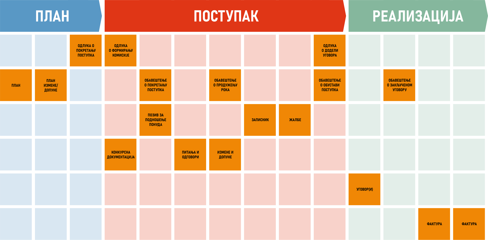
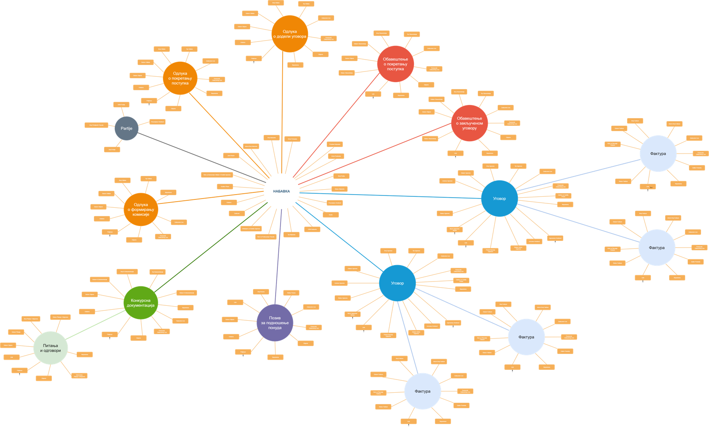

.. _koncept:

Концепт
=======

Ако бисмо у једној реченици морали да објаснимо шта је MeON, дефиниција би била следећа:

MeON
   софтверски систем намењен евиденцији, праћењу и контроли процеса у области набавки у државним предузећима

Да бисмо на прави начин разумели шта ова дефиниција заиста значи, шта MeON може пружити кориснику и на који начин, детаљније ћемо се позабавити набавкама.

Увод
-----

Уколико покушамо да сагледамо набавку из угла државног предузећа, у целини, убрзо ћемо схватити да је то захтеван процес, из много углова. На првом месту постоји чињеница да су државне набавке под будним оком закона, јавности и осталих субјеката више него било које друге. Законске директиве/регулативе се морају поштовати у потпуности у свим фазама процеса, свака радња мора бити транспарентна и сваки податак доступан. Једна од ствари које такође чине процес захтевним је број и различитост субјеката који суделују у процесу. Размена информација унутар делова организације, као и комуникација са екстерним субјектима захтева ангажованост и усклађеност већине сектора у организацији (правни, ит, финансијски, извршни, итд.). Хетерогеност технолошких решења унутар организације и осталих учесника у процесу додатно повећава ниво размене и складиштења података. Комплексност експоненцијално расте са бројем и различитошћу набавки.

MeON апликација је створена како би помогла организацији и њеним запосленима у превазилажењу главних изазова процеса набавке:

Закон
   Омогућава унос и праћење законски неопходних података уз поштовање законских процедура. Пружа транспарентност евидентираних података као и помоћ у пружању информација из актуелних закона.

Информациони аспект
   Омогућава лаку евиденцију и претрагу документације (и других релеватних података), квалитативну и квантитативну анализу процеса кроз извештаје. Такође, поштује начела приватности и доступности података.

Комуникација
   Омогућава интуитивну комуникацију на више нивоа унутар организације. MeON је намењен свим људима унутар организације који учествују у процесу набавке, од извршиоца до директора.

Организација
   Подржава постојеће интерне процедуре унутар и између сектора и смањује интеракцију између корисника. Поред тога, MeON омогућава евиденцију, праћење и анализу свих релевантних информација којим се остали информациони системи не баве.

Да бисмо разумели начин на који MeON све ово постиже, морамо кренути од суштине: података.

Подаци
------

Мноштво је података који се евидентирају и прате у току процеса. У првом реду су то законска документа попут Плана, разних Одлука, Обавештења или Позива, Конкурсне Документације, Уговора или Фактура. Неки од њих су јединствени, неки се понављају, неки су измене основних докумената итд. 

   Документи кроз фазе набавке

Такође, могу се евидентирати подаци који служе искључиво интерним потребама организације попут задужених лица, статуса или рокова. Статус плаћања фактуре, задужено лице или рок за израду конкурсне документације су интерни подаци који су саставни део процеса исто колико и законска документа. Када се број набавки у предузећу мултиплицира са количином података о једној набавци, добијамо велики број података који се прати и контролише. Све ове податке MeON омогућава да се евидентирају лако и благовремено, без обзира којег су типа и значаја. Уз то, омогућена је и колаборација корисника на тему конкретне набавке, уговора, фактуре или било ког другог ентитета.  

.. HINT::
   MeON апликација омогућава кориснику да евидентира како законске тако и податке које се тичу интерне организације

.. _entiteti:

Ентитети
--------

У данашње време, свака организација поседује софтверски информациони систем који евидентира, прати и контролише релевантне процесе. То може бити Excel или SAP, али сви они имају једну заједничку функционалност а то је свакако претрага података, тј. претрага регистра. Фактуре, Уговори, Набавке...све су то појмови над којима се врши нека врста претраге и евидентирање релевантних података. MeON ове појмове (као и неке друге) посматра као ентитете, да би унифицирао одређене радње попут претраге и евиденције. Дакле, сви ентитети у MeON апликацији имају сопствени регистар и све радње око претраге и евиденције су прилично исте за све њих. Нема много разлике у претрази или евиденцији фактура и уговора (сем самих података који се евидентирају). MeON иде корак даље и све ентитете поставља у хијерархијску структуру. Тако нпр. имамо ентитет Набавке који представља основни ентитет у хијерархији. Њему припада Конкурсна Документација, Решење о образовању комисије или Уговор (више њих), итд. Уговору припада Фактура (може бити више њих). Испод Конкурсне Документације је Питање (такође може бити више њих). Ова функционалност кориснику омогућава да се кроз податке набавке креће интуитивно и без застоја. Примена и значај ове функционалности у пракси ће бити показана у даљем тексту.

   Набавка - ентитети и структура

Сваки од поменутих ентитета садржи одређени број података који се прате. Већ смо закључили да постоје како законски тако и подаци намењени интерним потребама организације. Ентитете у MeON апликацији можемо евидентирати, претраживати кроз регистар или филтрирати по овим атрибутима.

.. _atributi:

Атрибути
---------

Атрибути су основне карактеристике ентитета који се евидентирају и прате. Најпростији пример за то је Процењена вредност Набавке. То може бити и Рок за предају понуда или Плаћена вредност Фактуре. Ово су обично прости типови података попут: 

* слова (назив Набаке, назив Понуђача, разни описи)
* бројева (број Понуђача, број Партија)
* износа (процењена вредност Набавке, плаћена вредност Фактуре, уговорена вредност)
* предефинисаних вредности (статус Набавке, тип Набавке, статус Фактуре итд).

Дакле, сви релевантни подаци који се евидентирају су у једном од горе поменутих типова. На основу њих се врши претрага, уносе подаци или анализирају извештаји.

.. _instance:

Инстанце
---------
Вероватно сте приметили да користимо велико прво слово код навођења ентитета. Ово чинимо да бисмо направили јасну диференцијацију између ентитета и инстанци. Поменули смо да ентитети представљају појмове који се користе у процесу набавке (Набавка, Конкурсна Документација, Уговор, Фактура) и имају свој регистар. Овде ћемо увести појам инстанце која представља конкретно појављивање ентитета у регистру (један ред у листи регистра). То може бити набавка бр. 202-1404/19 или уговор бр.6841/20. Даље, уговор бр.6841/20 може имати више инстанци Фактура које су плаћене по њему. Најпростије речено, инстанца ентитета представља конкретан документ у коме се налазе одређене информације и придружени документи (инстанце подентитета) а које даље кориснику омогућавају рад, анализу и контролу процеса. У наредном тексту ћемо користити појам инстанце када се будемо реферисали на неки конкретан документ:

* инстанца Набавке (набавка бр. 202-1404/19)
* инстанца Уговора (уговор бр. 4453/20)
* инстанца Фактуре (фактура бр. 345345/20)

.. _paketi:

Пакети
-------

Кад гледамо податке из угла корисника, јасно је да одређени корисник има право приступа одређеним ентитетима и атрибутима. Тако се нпр. финансијска служба  треба бавити Фактурама, и одређеним деловима Уговора. Такође, финансијска служба треба имати основне информације о Набавци попут типа и врсте, или релевантних особа. ИТ служба се треба бавити Конкурсном Документацијом. Начелници нпр једини могу знати процењене вредности Набавке, остали не.

MeON ову проблематику решава кроз пакете који одређују то шта све корисник може видети у оквиру целокупног регистра набавки (са свим пратећим документима/подентитетима). Дакле, основна улога пакета је да из мноштва података који се евидентирају кроз организацију, одређеном кориснику пружи само њему релевантне:

* Ентитете
* Атрибуте

Пакети пружају још додатних могућности али о томе такође касније.